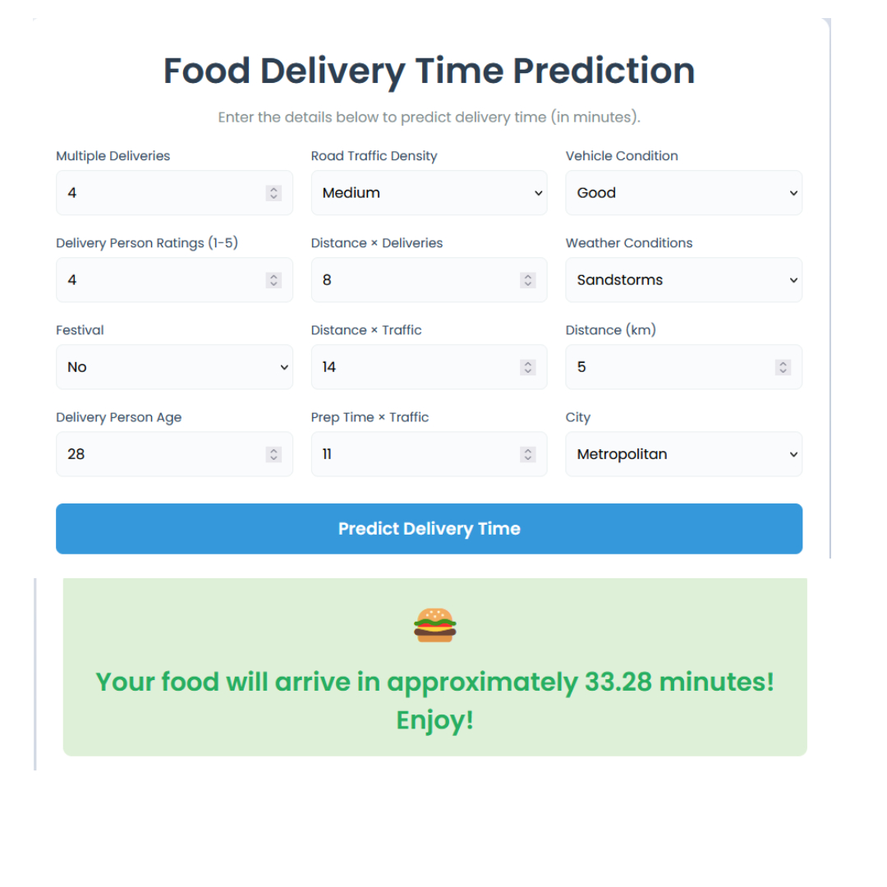

<h1 align="center">🚀 End-to-End MLOps Food Delivery Time Prediction Project 🍔📦</h1>

<p align="center">
  
</p>

<p align="center">
  <em>Predicting food delivery times using a fully automated MLOps pipeline with real-time monitoring and cloud deployment</em>
</p>

---

## 📌 Overview

This repository contains a **production-grade MLOps pipeline** for predicting food delivery times. The project demonstrates the complete machine learning lifecycle from data preprocessing and training to deployment and monitoring, following best practices in MLOps.  
It is designed for **scalability, observability**, and **automation** using cutting-edge tools like Docker, GitHub Actions, and AWS.

---

## 🧭 Project Structure

```
End-to-end-MLOps-Food-Delivery-Time-Prediction-Project/
├── .github/                         # GitHub workflows for CI/CD
│   └── workflows/
│       └── deploy.yml              # CI/CD pipeline for AWS deployment
├── artifacts/                       # Model and scaler artifacts
│   ├── models/
│   │   ├── model.pkl               # Trained XGBoost model
│   │   └── scaler.pkl              # Fitted StandardScaler
├── config/                          # Configuration files
│   └── paths_config.py             # Path definitions
├── Food_Delivery_Time_Prediction.egg-info/  # Python package metadata
├── logs/                            # Log files from app and pipeline
├── notebooks/                       # Exploratory data analysis notebooks
├── pipeline/                        # Training pipeline scripts
│   ├── __init__.py
│   └── training_pipeline.py        # End-to-end training script
├── src/                             # Source code
│   ├── __pycache__/                # Compiled Python files
│   ├── __init__.py
│   ├── custom_exception.py         # Custom exception handling
│   ├── data_ingestion.py           # Data loading logic
│   ├── data_processing.py          # Data preprocessing logic
│   ├── feature_store.py            # RedisFeatureStore for feature management
│   ├── logger.py                   # Logging utility
│   └── model_training.py           # Model training and evaluation
├── static/                          # Static assets for Flask app
│   └── favicon.ico                 # Browser favicon
├── templates/                       # HTML templates for Flask
│   └── index.html                  # Main webpage
├── tests/                           # Unit tests
├── .gitignore                       # Git ignore file
├── app.py                           # Flask application with prediction and drift detection
├── docker-compose.yml               # Docker Compose for local development
├── Dockerfile                       # Docker configuration for app
├── instruction.md                   # Additional project instructions
├── requirements.txt                 # Python dependencies
└── setup.py                         # Project setup script
```


---

## 🛠️ Technologies Used

- 🐍 **Python 3.10+**
- ⚙️ **Flask** – RESTful API
- 📦 **XGBoost** – Model for regression
- 🧠 **Scikit-learn**, **Pandas**, **NumPy** – Data wrangling & model evaluation
- 🔧 **Redis** – Real-time feature store
- 🧪 **Alibi Detect** – Data drift monitoring
- 🐳 **Docker** – Containerization
- ✅ **GitHub Actions** – CI/CD automation
- ☁️ **AWS Elastic Beanstalk** – Cloud deployment

---

## ⚙️ Setup Instructions

```bash
# 1. Clone the repo
git clone https://github.com/yourusername/End-to-end-MLOps-Food-Delivery-Time-Prediction-Project.git
cd End-to-end-MLOps-Food-Delivery-Time-Prediction-Project

# 2. Create and activate a virtual environment
python -m venv venv
source venv/bin/activate  # On Windows: venv\Scripts\activate

# 3. Install dependencies
pip install -r requirements.txt

# 4. Run Redis locally (optional for testing)
docker run -p 6379:6379 redis

# 5. Start the Flask app
python app.py
```

---

## 🧪 Training the Model

To run the full training pipeline:

```bash
python pipeline/training_pipeline.py
```

Artifacts (model, scaler) will be saved in the `artifacts/models/` directory.

---

## 🔍 Model Monitoring

- Alibi Detect is integrated for monitoring **data drift**.
- Redis is used as a **feature store** to track incoming requests.
- Logging captures model performance and request metadata.

---

## 🔄 CI/CD Pipeline

- **Trigger:** Code pushed to the `main` branch
- **Steps:** Lint → Test → Build Docker Image → Deploy to AWS
- Defined in `.github/workflows/deploy.yml`

---

## 🚀 Deployment

This app is deployed on **AWS Elastic Beanstalk** using Docker.  
You can deploy it locally using:

```bash
docker build -t delivery-time-predictor .
docker run -p 5000:5000 delivery-time-predictor
```

Then go to [http://localhost:5000](http://localhost:5000) in your browser.

---

## 📄 License

This project is licensed under the MIT License.

---

## Contact

- **Author**: Faheem Khan
- **Email**: faheemthakur23@gmail.com
- **GitHub**: https://github.com/FaheemKhan0817

## 🙌 Acknowledgements

- Inspired by real-world food delivery use-cases
- Tools by Open Source communities ❤️
